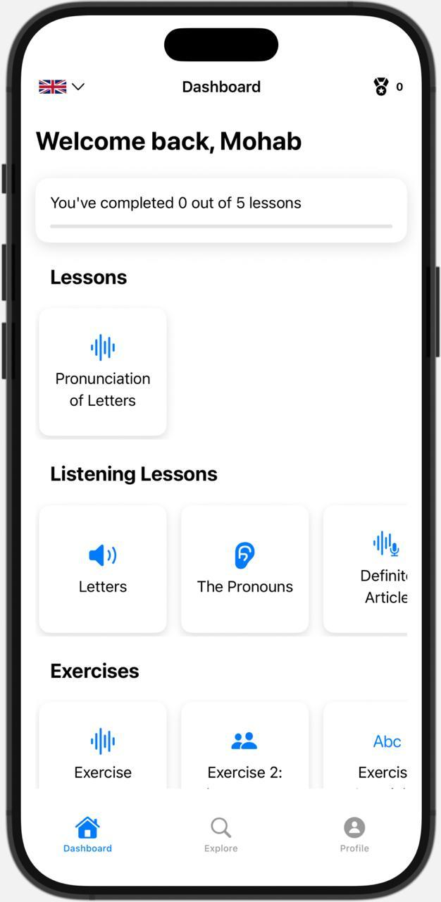
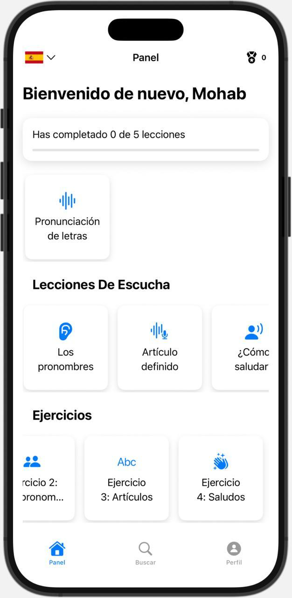
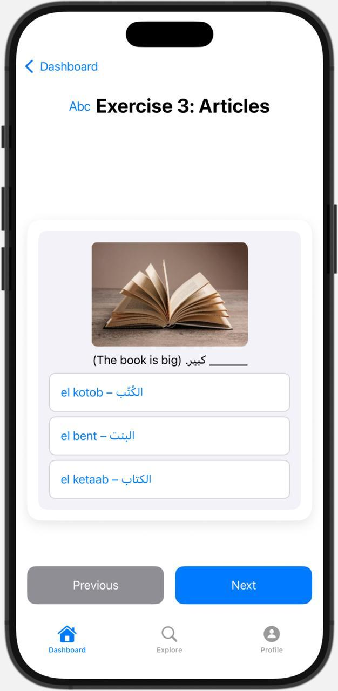
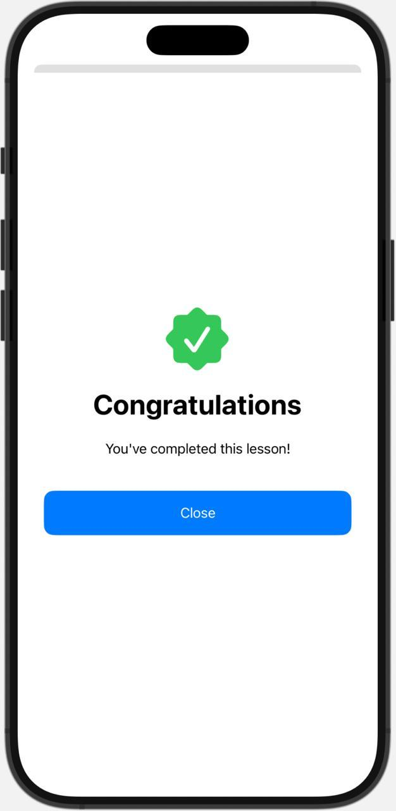
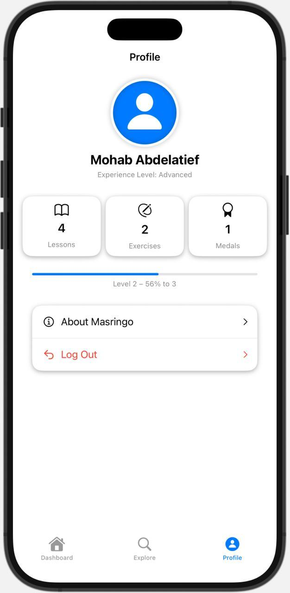

# Masringo 🇪🇬

> An iOS app that teaches the **Egyptian Arabic dialect** to English and Spanish speakers — through interactive lessons, audio, and exercises, with a fully localized, switchable interface.

  

## Screenshots

**One interface, two languages — switchable at runtime:**

| English | Español |
|---|---|
|  |  |

| Exercise | Lesson Complete | Profile |
|---|---|---|
|  |  |  |

## Overview

Masringo makes learning Egyptian Arabic approachable for both English- and Spanish-speaking learners. The **entire interface is localized in English and Spanish** and switchable on the fly — the app rebinds its localized bundle at runtime rather than relying on the system locale. Content is organized into lessons, listenable audio lessons, and interactive exercises, all reachable from a progress-oriented dashboard.

## Features

- 📚 **Lessons** — structured content like pronunciation of letters, delivered as swipeable cards
- 🔊 **Audio (listening) lessons** — native audio playback via AVFoundation for letters, pronouns, articles, and greetings
- ✏️ **Interactive exercises** — multiple-choice questions pairing Arabic script with transliteration and English meaning
- 🌍 **In-app language switching (EN / ES)** — change the interface language instantly from the toolbar; the choice persists across launches
- 🏁 **First-launch language selection**, a **progress dashboard**, and a **profile** with lesson/exercise counts, levels, and medals
- 🧩 Clean, reusable SwiftUI component structure

## Architecture & Tech

| Area | Detail |
|---|---|
| UI | SwiftUI (`NavigationStack`, environment-injected state) |
| Audio | AVFoundation (`AVAudioPlayer`) |
| Localization | Custom `LanguageManager` + per-language `.lproj` bundles, swapped at runtime |
| State | `ObservableObject` managers (`LanguageManager`, `AudioPlayer`) |
| Persistence | `UserDefaults` for the selected language |
| Content model | `LessonItem` / `LessonCard` with a `LessonType` (lesson · audio · exercise) |

### How the localization works

Rather than depending on the device language, Masringo loads the `.strings` table from the selected language's bundle at runtime:

```swift
func localized(_ key: String, with manager: LanguageManager) -> String {
    Bundle.localizedBundle(for: manager.language)
        .localizedString(forKey: key, value: nil, table: nil)
}
```

Switching language updates a published property and persists it to `UserDefaults`, so the whole UI re-renders in the new language immediately.

## Project Structure

```
Masringo/
├── Managers/        # LanguageManager, AudioPlayer
├── Models/          # LessonItem, LessonCard, LessonType
├── Data/            # LessonData + en.lproj / es.lproj
├── Views/           # Dashboard, Explore, Profile, LanguageSelection, detail & helper views
└── MasringoApp.swift
```

## Getting Started

```bash
git clone https://github.com/MohabAbdelatief/Masringo.git
open Masringo/Masringo.xcodeproj
```

Build & run in Xcode on an iOS simulator or device.
